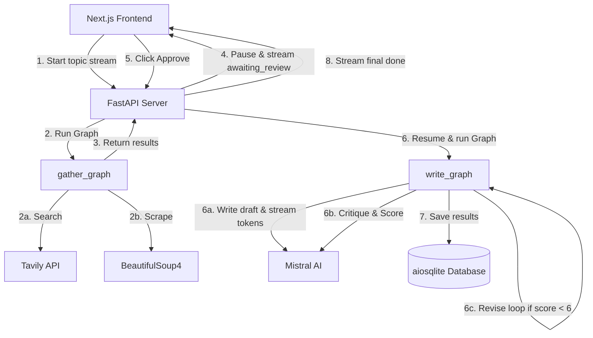

# DeepTheoria: Multi-Agent Research Assistant

DeepTheoria is a modern, full-stack multi-agent AI system designed to autonomously perform deep research on any given topic, compile structured reports, and iteratively critique and revise its findings.

This repository is built with a decoupled frontend and backend architecture, demonstrating **agent orchestration**, **server-side streaming (SSE)**, and **interactive Human-in-the-Loop (HITL) review**.

## Architecture




DeepTheoria leverages a sophisticated graph-based multi-agent system:

1. **Gather Graph**: Searches the web using Tavily API and scrapes relevant pages using BeautifulSoup to gather raw information.
2. **Human-in-the-Loop (HITL)**: Execution pauses and streams the gathered sources to the UI for human approval.
3. **Write Graph**: Once approved, the LLM drafts a comprehensive Markdown report. A "Critic Node" then evaluates the drafted report. If the score is below a certain threshold, the system automatically loops back to revise the draft.

### Tech Stack

**Backend (`apps/backend`)**

- **Python 3.10+**
- **FastAPI** & **Uvicorn**: High-performance API server with Server-Sent Events (SSE) support.
- **LangGraph** & **LangChain**: For creating the multi-agent workflows and state management.
- **Mistral AI**: The core Large Language Model used for drafting and critiquing.
- **Tavily API**: For robust, AI-focused web search.
- **aiosqlite**: Asynchronous SQLite database for persisting research history.

**Frontend (`apps/frontend`)**

- **Next.js** (App Router): React framework for the UI.
- **Tailwind CSS**: For utility-first styling.
- **Shadcn UI**: For beautiful, accessible, and customizable components.

---

## Getting Started

To run DeepTheoria locally, you will need API keys for **Mistral AI** and **Tavily**.

### 1. Clone & Setup

Initialize the repository and install frontend dependencies:

```bash
git clone <repository-url>
cd DeepTheoria
cd apps/frontend
bun install  # or npm install / pnpm install
```

### 2. Backend Configuration

Navigate to the backend directory and set up your Python environment:

```bash
cd apps/backend
uv venv
source .venv/bin/activate  # On Windows: .venv\Scripts\activate
uv pip install -r requirements.txt
```

Create a `.env` file in `apps/backend/` and add your API keys:

```env
MISTRAL_API_KEY=your_mistral_api_key_here
TAVILY_API_KEY=your_tavily_api_key_here
```

### 3. Running the System

Start the FastAPI backend:

```bash
cd apps/backend
uvicorn main:app --reload
# The backend runs at http://localhost:8000
```

Start the Next.js frontend in a new terminal:

```bash
cd apps/frontend
bun run dev
# The frontend runs at http://localhost:3000
```

Visit `http://localhost:3000` to interact with DeepTheoria.

---

## Features

- **Live Pipeline Progress**: Track the agent's progress visually as it searches, scrapes, writes, and critiques.
- **Token Streaming**: Watch the generated research report stream in real-time.
- **Interactive Review**: Pause the generation to manually review the raw scraped data before the LLM burns tokens writing the final report.
- **History View**: Browse, read, and manage previously completed research reports, all persisted in a local database.

## Project Structure

```
DeepTheoria/
├── apps/
│   ├── backend/          # FastAPI, LangGraph, and Python Agent Logic
│   └── frontend/         # Next.js UI, React Hooks, and Tailwind CSS
├── learning_guide.md     # Step-by-step implementation guide
└── README.md             # This file
```
